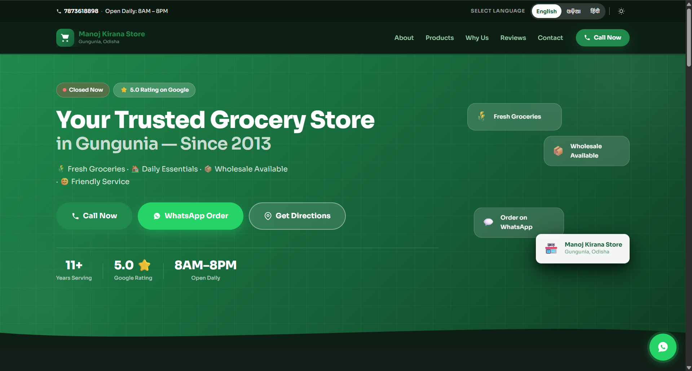
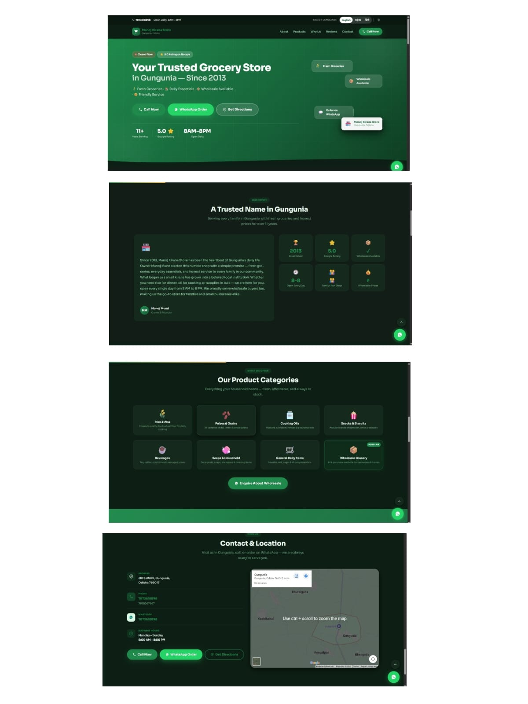
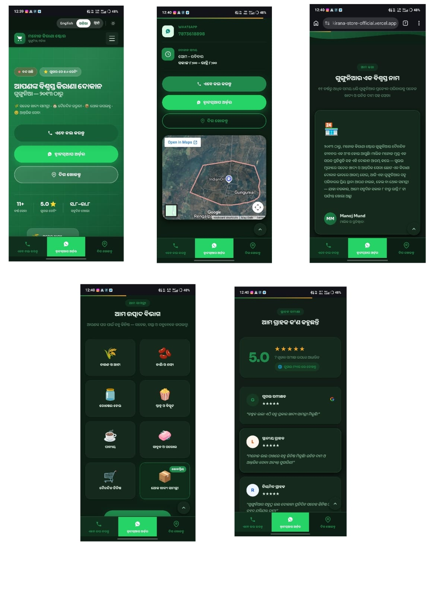

# 🏪 Manoj Kirana Store – Official Website





# 📸 Website Preview

### Desktop View



### Mobile View




A modern **mobile-first bilingual website** built for **Manoj Kirana Store**, a trusted local grocery shop serving the community of **Gungunia, Odisha** since **2013**.

This project focuses on building a **clean, fast, and accessible digital presence for a local kirana store**, helping customers easily find the shop, contact the owner, and explore available products.

---

# 🌐 Live Website

https://manoj-kirana-store-official.vercel.app/

---
# ✨ Features

## 📱 Mobile-First Design

The website is designed primarily for smartphone users to ensure smooth access for local customers.

## 🌍 Bilingual Language Support

The website supports:

* English
* Odia (ଓଡ଼ିଆ)

Users can switch languages easily using the language toggle.

## 📞 Quick Contact Options

* Click-to-Call buttons
* WhatsApp ordering
* Google Maps directions

## 🗺 Google Maps Integration

Customers can easily find the store location using the embedded map.

## ⭐ Google Rating Highlight

Displays the store's **5.0 ⭐ Google rating** to build trust.

## 📦 Wholesale Availability

The store provides **wholesale grocery items for bulk buyers**.

## ⚡ Lightweight & Fast

Built using **pure HTML, CSS, and JavaScript** to ensure fast loading even on slower internet connections.

---

# 🏪 Business Information

| Field               | Details                   |
| ------------------- | ------------------------- |
| **Business Name**   | Manoj Kirana Store        |
| **Owner**           | Manoj Mund                |
| **Established**     | 2013                      |
| **Category**        | Indian Grocery Store      |
| **Location**        | Gungunia, Odisha – 766017 |
| **Primary Phone**   | 7873618898                |
| **Alternate Phone** | 7978567667                |
| **Business Hours**  | 8:00 AM – 8:00 PM         |
| **Google Rating**   | ⭐ 5.0                     |
| **Services**        | Wholesale Grocery         |

---

# 🛒 Product Categories

The store provides many daily household items including:

* 🌾 Rice & Atta
* 🫘 Pulses & Grains
* 🫙 Cooking Oils
* 🍿 Snacks & Biscuits
* ☕ Beverages
* 🧼 Soaps & Household Essentials
* 🛒 Daily Use Items
* 📦 Wholesale Grocery Products

---

# 🛠 Tech Stack

This website is built using simple and efficient technologies.

| Technology   | Purpose              |
| ------------ | -------------------- |
| HTML5        | Website structure    |
| CSS3         | Styling and layout   |
| JavaScript   | Interactivity        |
| Google Fonts | Typography           |
| Google Maps  | Location integration |

No heavy frameworks were used to keep the site **fast, simple, and accessible**.

---

# 📱 Responsive Design

The website is optimized for all screen sizes:

* 📱 Mobile
* 📲 Tablet
* 💻 Laptop
* 🖥 Desktop

This ensures a smooth experience for all users.

---

# 📂 Project Structure

```
manoj-kirana-store-website
│
├── index.html
├── README.md
└── assets
     ├── images
     └── screenshots
```

---

# 🚀 Deployment

The website is deployed using:

GitHub + Vercel

Deployment flow:

Local Development
↓
Push Code to GitHub
↓
Vercel Automatic Deployment
↓
Live Website

---

# 🎯 Project Purpose

This project demonstrates how **simple web technologies can help small local businesses create a digital presence**.

Goals of this project:

* Improve local online visibility
* Help customers easily find the store
* Provide quick contact options
* Build trust with customers
* Support digital transformation of small businesses

---

# 👨‍💻 Author

**Raj Mund**

BCA Student
Focused on:

* Web Development
* Digital Branding
* Real-world projects
* Local business digital transformation

---

# 🔮 Future Improvements

Possible future upgrades:

* Product gallery
* Online order form
* Store photo gallery
* SEO optimization
* Google Analytics
* Custom domain

---

# ⭐ Support

If you like this project, consider giving it a **⭐ star on GitHub**.

---

# 📍 Serving Gungunia With Trust Since 2013

**Manoj Kirana Store**
Your trusted neighborhood grocery store.
